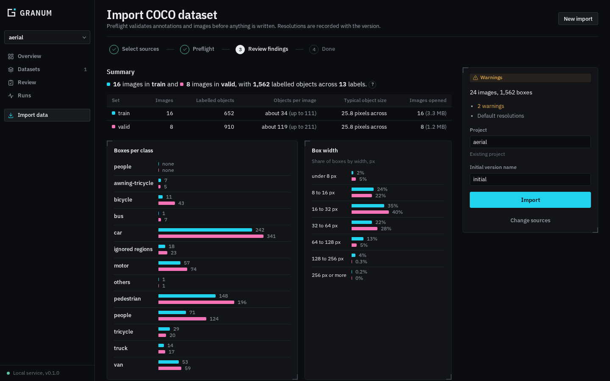
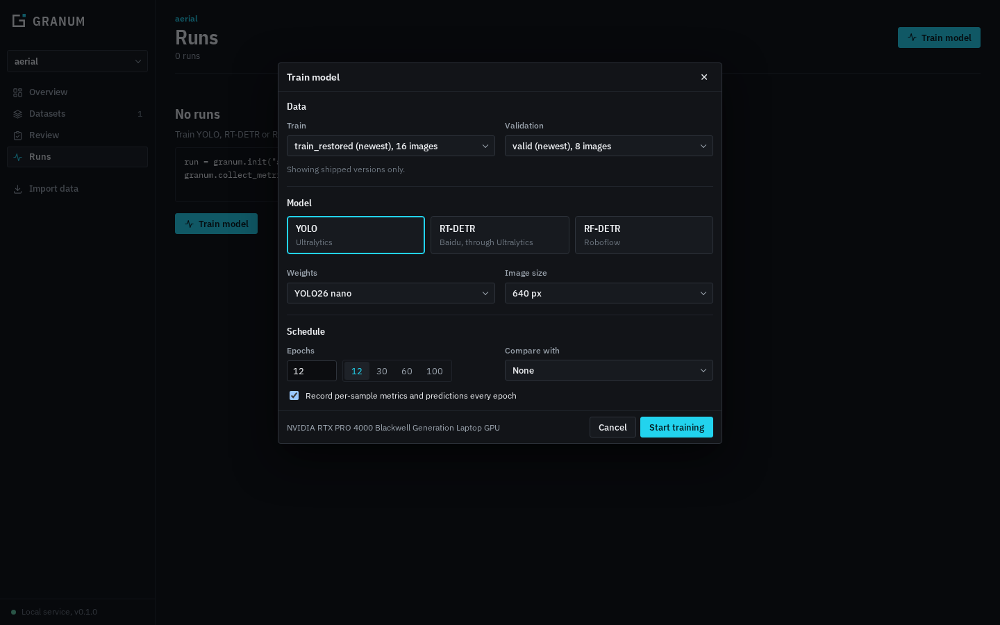
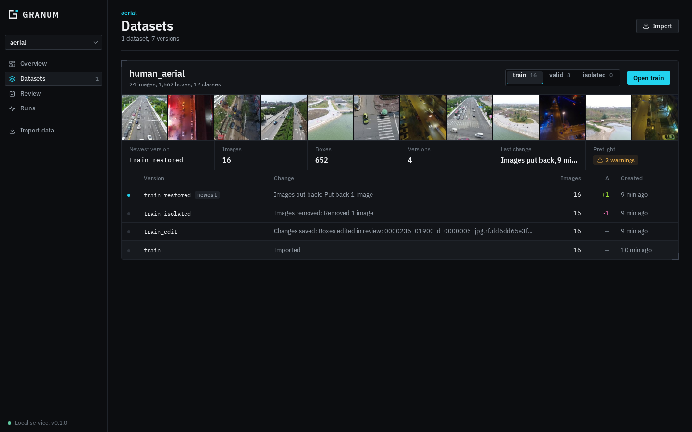

<p align="center">
  <picture>
    <source media="(prefers-color-scheme: dark)" srcset="brand/granum-lockup-on-dark.svg">
    
  </picture>
</p>

<p align="center">
  <strong>The data workbench for computer-vision teams.</strong><br>
  Import, review, fix and ship training data, then train on exactly what was approved and see which images the model struggles with.
</p>

<p align="center">
  
  
  
  
</p>

---

Granum keeps training data as **versioned tables** and model behaviour as **per-sample runs**.
A score you don't like leads straight to the image behind it; fixing that image creates a new
version that the next training run uses. Nothing is overwritten, every decision is recorded,
and your data never leaves your machine.

## Contents

- [Why Granum](#why-granum)
- [The workflow](#the-workflow)
- [Features](#features)
- [Quick start](#quick-start)
- [Using Granum from Python](#using-granum-from-python)
- [How it works](#how-it-works)
- [Repository layout](#repository-layout)
- [Documentation](#documentation)
- [Development](#development)
- [Status](#status)
- [License](#license)

## Why Granum

Most accuracy problems in production vision models are data problems: missing boxes, wrong
classes, leaked duplicates between train and validation, unusable images. Teams find them late
and fix them in spreadsheets and chat threads, with no record of what changed or why.

Granum is one local tool for the whole loop:

| Problem | What Granum does |
|---|---|
| A new dataset arrives with hidden issues | A **preflight** health check finds them before anything is imported, and you choose how each one is handled |
| Labelling quality is checked ad hoc | A **Review** tab puts every image through *unreviewed → reviewed / rework*, with comments for the annotation team |
| Nobody knows which data a model was trained on | Datasets are **shipped** as exact versions, and training accepts only shipped versions |
| "Which images is the model getting wrong?" | Per-image metrics every epoch show which images were learned early, late, or never |
| Fixes get lost or overwrite each other | Every change is a new **version** with its parent recorded, so you can always go back |

## The workflow

```
  Import ──► Preflight ──► Review ──► Ship ──► Train ──► Inspect ──┐
    ▲                        ▲                                       │
    │                        └────────── fix, rework, isolate ◄──────┘
    └── new data
```

1. **Import** a COCO dataset (train, valid and test together) from the dashboard or the CLI.
2. **Preflight** checks annotations and images: broken files, leakage between sets, malformed or
   zero-size boxes, ignore-region categories, duplicates. You decide how each finding is handled;
   the decision is recorded with the version.
3. **Review** every image. Reviewers mark images *Reviewed* or send them for *Rework* with a
   comment. Annotators fix boxes directly in the viewer. Problem images can be **isolated** so the
   rest can move on, or **deleted** (recoverably).
4. **Ship** the dataset once every image is reviewed. The shipment records the exact version of each set.
5. **Train** YOLO, RT-DETR or RF-DETR on shipped versions from the dashboard, on your GPU.
6. **Inspect** the run: mAP, precision and recall per epoch, and when each image was learned.
   Open the hard images, fix them, and ship the next version.

## Features

<table>
<tr>
<td width="50%" valign="top">

**Import with preflight**

Point at a dataset folder; train, valid and test are found together. Two dozen checks, each with
counts per set, example images and a recommended action. Imports are confined to configured data roots.

</td>
<td width="50%" valign="top">

</td>
</tr>
<tr>
<td width="50%" valign="top">

</td>
<td width="50%" valign="top">

**Review, rework and fix in one place**

- Status per image: *Unreviewed*, *Reviewed*, *Rework* (with a reason)
- A comment thread per image, with who did what and when
- Draw, delete and relabel boxes; saved as a new version when you move on
- Bulk actions on a selection; keyboard shortcuts for everything
- **Isolate** images so the rest can ship; return them later
- **Delete** into a recoverable removed set

</td>
</tr>
<tr>
<td width="50%" valign="top">

**Ship, then train**

Shipping is gated: the button stays disabled until every image in every set is reviewed. Training
lists shipped versions only, and the service refuses anything else. Choose the detector family, weights,
image size and epochs, and compare against an earlier run scored on the same labels.

</td>
<td width="50%" valign="top">

</td>
</tr>
<tr>
<td width="50%" valign="top">

</td>
<td width="50%" valign="top">

**Versioned datasets with full lineage**

Every edit, removal, isolation and restore writes a new version naming its parent. Browse each set's
history, open any version, and train on exactly the one you mean. Earlier versions are never modified.

</td>
</tr>
</table>

**Also included**

- **Inspection workspace** for any dataset or run: linked rows, filters and charts; lasso a scatter
  to filter; per-box filters (class, area, confidence, matched); editing with undo and commit;
  NMS; a patch view of every box. Holds 60 fps on a million rows.
- **Training dynamics**: per-image F1 every epoch, grouped into *early*, *mid*, *late*, *forgotten* and *never learned*,
  with a round-by-round image viewer comparing labels and predictions.
- **Python SDK**: add three lines to your own training loop to log per-sample metrics that join back
  to the exact images.
- **Formats**: COCO and YOLO import and export, image folders, Ultralytics and RF-DETR integrations.
- **Storage**: local disk by default; S3, GCS and Azure through fsspec.
- **Local and locked down**: loopback-only by default, Host and Origin checks, every path validated against configured roots.

## Quick start

### Download and run (Linux)

1. Download **`Granum-0.1.0-x86_64.AppImage`** from the releases page. It is one file (about 250 MB)
   with everything inside: Python, all libraries, the dashboard and its window.
2. Make it executable and open it:

   ```bash
   chmod +x Granum-0.1.0-x86_64.AppImage
   ./Granum-0.1.0-x86_64.AppImage
   ```

   (or right-click → Properties → *Allow executing file as program*, then double-click).

No internet connection, Python, Node.js or other packages are needed. On first launch Granum installs
itself: a **Granum** entry in the application menu, a background service that starts at login, and its
own window. The downloaded file can be deleted afterwards.

**Training** is the one part that downloads later: the first time you train, Granum offers to install
PyTorch and Ultralytics (about 3 GB) into its own folder. Training on a GPU needs the NVIDIA driver.

Everything you do is kept across restarts, reboots and upgrades:

| What | Where |
|---|---|
| Projects, dataset versions, reviews, comments, shipments, runs | `~/granum` |
| Trained and downloaded model weights | `~/granum-training` |
| Settings (project location, port) | `~/.config/granum/config.granum.yaml` |
| The app, and the training add-on | `~/.local/share/granum` |

To upgrade, open a newer AppImage once. To uninstall, run `~/.local/share/granum/Granum.AppImage app uninstall`;
your data is kept.

### Download and run (Windows)

1. Download **`Granum-0.1.0-Setup.exe`** from the releases page (Windows 10 1809 or later, 64-bit).
2. Run it. It installs for your user only, without administrator rights, and adds **Granum** to the
   Start menu (and optionally the desktop). The installer is not code-signed yet, so Windows SmartScreen
   may warn first: choose *More info* → *Run anyway*.

No internet connection, Python or other packages are needed. Opening Granum starts its background
service; closing the window stops it again unless an import, training or add-on install is still running.
Training downloads PyTorch with CUDA and Ultralytics on first use, as on Linux (needs a recent NVIDIA
driver for GPU training).

| What | Where |
|---|---|
| Projects, dataset versions, reviews, comments, shipments, runs | `%USERPROFILE%\granum` |
| Trained and downloaded model weights | `%USERPROFILE%\granum-training` |
| Settings (project location, port) | `%APPDATA%\Granum\config.granum.yaml` |
| The app | `%LOCALAPPDATA%\Programs\Granum` |
| The training add-on, window storage and logs | `%LOCALAPPDATA%\Granum` |

To upgrade, run a newer Setup.exe. To uninstall, use *Settings → Apps → Granum*; your data is kept.
Datasets can be imported from your user folder and any local or removable drive.

### From source

**Requirements:** Linux with Python 3.10+ and Node.js 20+.

```bash
git clone <your-remote>/granum.git
cd granum
./install.sh              # add --training to also install Ultralytics (YOLO, RT-DETR)
```

Then, in the dashboard:

1. **Import data** → open your dataset folder → **Add all sets** → **Run preflight** → resolve findings → **Import**.
2. **Review** → type your name → open images, mark *Reviewed* (`A`) or *Rework* (`R`), fix boxes.
3. **Ship** when the progress bar reaches 100%.
4. **Runs** → **Train model** → pick the shipped versions → **Start training**.

The same import from the command line:

```bash
granum import coco train=data/train/_annotations.coco.json valid=data/valid/_annotations.coco.json \
    --project aerial --check-only      # report only; non-zero exit on blocking problems
granum import coco train=... valid=... --project aerial
```

To keep projects somewhere else (for example a larger disk), set it once before installing:
`granum config project-root /mnt/data/granum`, then `./install.sh`.

## Using Granum from Python

```python
import granum

table = granum.Table.from_coco("instances_train.json", "images/", project_name="aerial", dataset_name="train")
cleaned = table.delete_rows([3, 17]).set_weights({0: 0.0})     # new versions; the original is untouched
print(cleaned.lineage())

run = granum.init("aerial", "baseline", parameters={"lr": 1e-3})
for epoch in range(epochs):
    ...                                                          # your loop, unchanged
    granum.log({"epoch": epoch, "train_loss": loss})
    granum.collect_metrics(table, collectors, predictor=predictor, constants={"epoch": epoch})

# Train on the newest reviewed version, weighting out excluded samples
latest = granum.Table.from_names("aerial", "train", "initial").latest()
loader = DataLoader(latest.with_transform(load), sampler=granum.create_weighted_sampler(latest))
```

More in [docs/python-sdk.md](docs/python-sdk.md), and runnable end-to-end scripts in [`examples/`](examples).

## How it works

```
┌──────────────────────── your machine ────────────────────────┐
│                                                                │
│  Dashboard (React, Vite)  ◄── HTTP/JSON, Arrow ──►  Object Service (FastAPI)
│   web/                                              src/granum/service
│                                                         │
│  Python SDK / CLI  ─────────────► Tables, Runs, logs ◄──┘
│   src/granum                      Parquet + JSON on disk / S3 / GCS / Azure
│                                                         │
│  Training subprocess (Ultralytics / RF-DETR) ───────────┘
└────────────────────────────────────────────────────────────────┘
```

- A **Table** is an immutable, versioned dataset: a directory with `object.granum.json` (schema,
  parents, the operation that produced it) and `row_cache.parquet` (the rows).
- A **Run** records parameters, per-epoch scalars and **metrics tables** keyed by `example_id`,
  so every metric joins back to its row.
- **Review logs** and **shipments** are append-only JSON lines per dataset, keyed by image
  reference, so they survive new versions.
- The **Object Service** indexes project roots, serves rows as Arrow, thumbnails and media, and
  runs import and training jobs. The dashboard is a static build it serves.

Details: [docs/architecture.md](docs/architecture.md).

## Repository layout

```
granum/
├── brand/                  Logo: mark, lockups and app icon (SVG)
├── docs/                   Product and developer documentation
│   └── assets/screenshots/
├── examples/               End-to-end scripts: tables, runs, CIFAR-10, YOLO, aerial pipeline
├── src/granum/
│   ├── core/               Object model: tables, runs, schemas, storage, index, curation, reviews, qa
│   ├── formats/            COCO and YOLO import and export
│   ├── importing/          Preflight checks and applying resolutions
│   ├── metrics/            Collectors, detection metrics, training dynamics
│   ├── integration/        Ultralytics and RF-DETR callbacks
│   ├── training/           Dashboard training: model families, trainer, evaluation
│   ├── service/            FastAPI Object Service, jobs, media cache
│   ├── assets/             App icons installed with the launcher
│   ├── addons.py           The training add-on, installed on demand into Granum's own folder
│   └── cli/                The `granum` command, and app install (service, launcher)
├── tests/                  Backend tests (pytest)
├── web/                    Dashboard (React, TypeScript, Vite, deck.gl)
│   └── src/
│       ├── pages/          Overview, datasets, runs, learning, removed
│       ├── review/         Review tab, image inspector with box editing, ship dialog
│       ├── importing/      Import wizard and preflight report
│       ├── training/       Train dialog and progress
│       ├── shell/          Sidebar and inspection workspace
│       └── store/          State, filtering, editing, selection
├── .github/workflows/      CI: lint, backend tests (3.10 to 3.12), dashboard tests and build
├── packaging/linux/        Builds the self-contained AppImage (Python, Qt WebEngine window, dashboard)
├── packaging/windows/      Builds the Windows installer (same bundle, packed by Inno Setup)
├── install.sh              One-command install, upgrade and uninstall as a desktop app
├── hatch_build.py          Builds the dashboard into the package during pip install
├── pyproject.toml
└── LICENSE
```

## Documentation

| Guide | What it covers |
|---|---|
| [Getting started](docs/getting-started.md) | Install, first import, first review, first training run |
| [Review and shipping](docs/review-and-shipping.md) | Statuses, comments, box editing, isolate, delete, ship, keyboard shortcuts |
| [Importing data](docs/importing.md) | Preflight checks, resolutions, CLI import, data roots |
| [Dashboard workspace](docs/dashboard.md) | Rows, filters, charts, editing, detection tools |
| [Python SDK](docs/python-sdk.md) | Tables, runs, metrics, samplers, formats, integrations |
| [Service and CLI](docs/service.md) | Commands, configuration, REST API, security model |
| [Architecture](docs/architecture.md) | Data model, storage layout, components |
| [Development](docs/development.md) | Dev setup, tests, builds, CI, conventions |

## Development

```bash
./install.sh --dev                           # editable install, running as the app on :8000
systemctl --user restart granum              # load Python changes
cd web && npm run dev                        # dashboard with hot reload on :5173, using the service on :8000

python3 -m pytest                            # backend tests
cd web && npm run test && npm run build      # dashboard tests and production build
ruff check src tests                         # lint
```

See [docs/development.md](docs/development.md) for conventions and the release build.

## Status

**Alpha (0.1).** The full loop (import, preflight, review, ship, train, inspect) works end to end
on real detection datasets. Known limits:

- Single-user local service: no authentication or per-user assignment yet; reviewer names are self-reported.
- Boxes can be drawn, deleted and relabelled in the Review tab; moving and resizing are in the inspection workspace.
- RT-DETR and RF-DETR training have been smoke-tested only.
- The browser loads every row of a set; very large sets (100k+ images) are slow to open.

## License

Proprietary. Copyright © 2026 Siddharth Umakarthikeyan and Melvin Jacob. All rights reserved. See [LICENSE](LICENSE).
