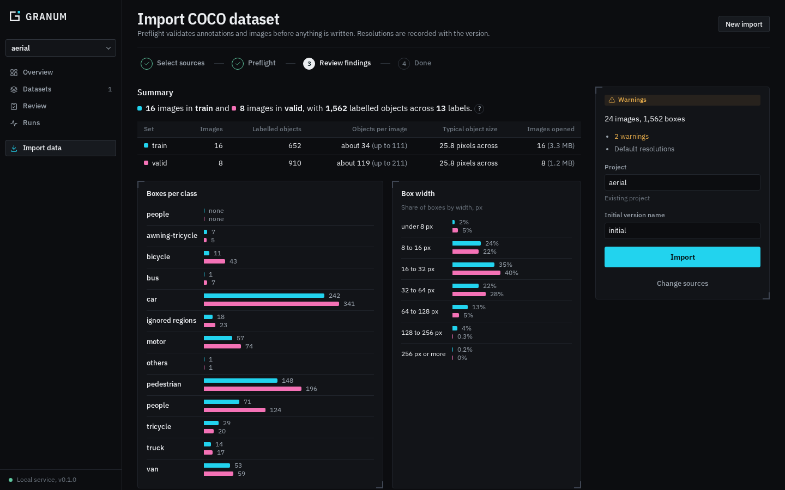
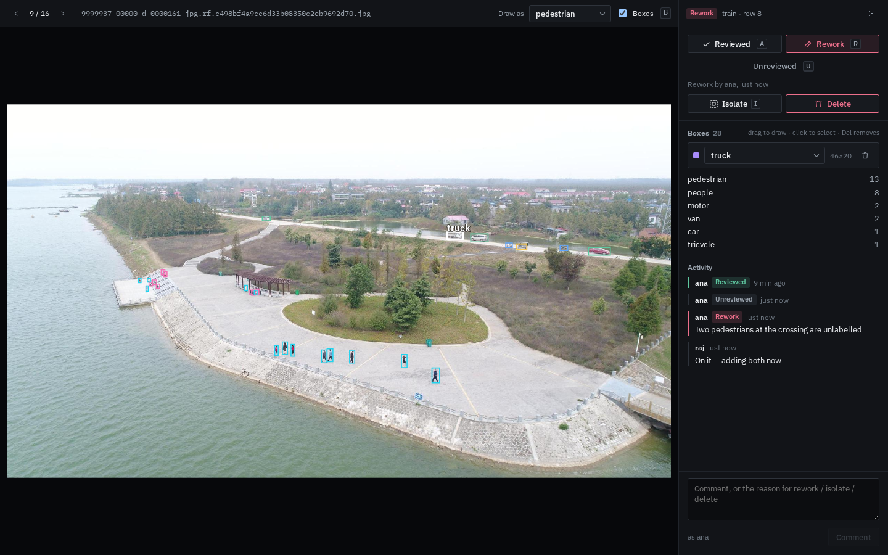
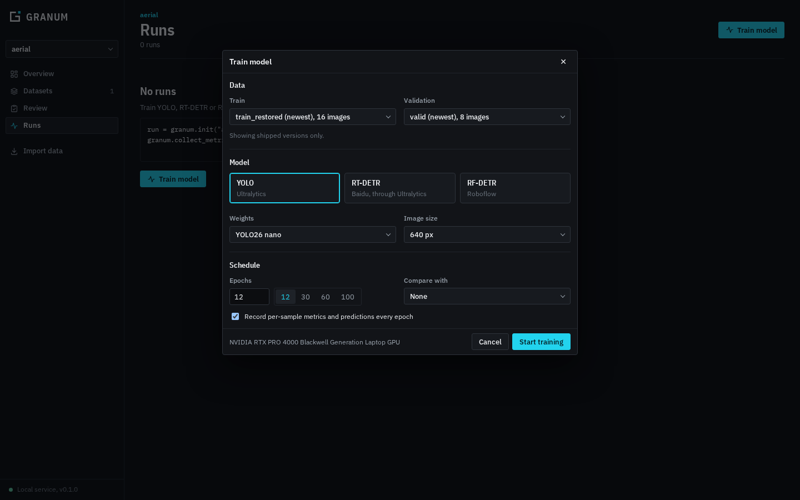
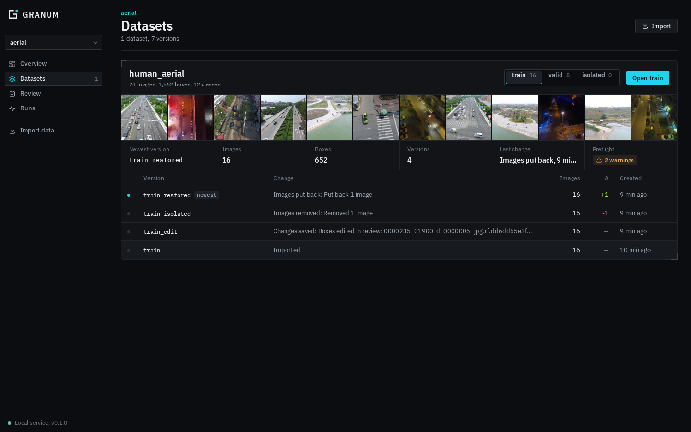

<p align="center">
  <picture>
    <source media="(prefers-color-scheme: dark)" srcset="brand/granum-lockup-on-dark.svg">
    
  </picture>
</p>

<p align="center">
  <strong>The data workbench for computer-vision teams.</strong><br>
  Import, review and fix training data. Create exploratory versions, approve reviewed releases separately, and train on exact versioned inputs.
</p>

<p align="center">
  
  
  
  
</p>

---

Granum keeps training data as **versioned tables** and model behaviour as **per-sample runs**.
A score you want to investigate leads to the image behind it; a justified correction creates a new
table version for a later experiment. The default workflow is local-first; optional cloud storage,
authenticated sharing and configured training integrations extend that boundary.

**Start with the [guided aerial-data course](https://granum.app/docs/course/start):** 120 real sample
images, step-by-step explanations, actual screenshots, 10 captioned videos, real training/comparison
results, two-image approval/export, and a verified backup/restore. It explains poor results honestly
rather than treating a successful training process as a production model. [Lesson map](docs/getting-started.md).

## Contents

- [Why Granum](#why-granum)
- [The workflow](#the-workflow)
- [Features](#features)
- [Quick start](#quick-start)
- [Using Granum from Python](#using-granum-from-python)
- [How it works](#how-it-works)
- [Repository layout](#repository-layout)
- [Documentation](#documentation)
- [Development](#development)
- [Status](#status)
- [License](#license)

## Why Granum

Data problems can undermine vision models: missing boxes, inconsistent classes, leaked duplicates
between train and validation, or unreadable images. A weak recipe, insufficient training or a mismatched
evaluation policy can also produce poor scores. Granum helps inspect the evidence and record decisions
instead of assuming every model failure is a label error.

Granum is one local tool for the whole loop:

| Problem | What Granum does |
|---|---|
| A new dataset arrives with hidden issues | A **preflight** health check finds them before anything is imported, and you choose how each one is handled |
| Labelling quality is checked ad hoc | A **Review** tab puts every image through *unreviewed → reviewed / rework*, with comments for the annotation team |
| Nobody knows which data a model was trained on | Dashboard training selects exact **dataset versions**; exploratory use and explicit release approval are separate |
| "Which images is the model getting wrong?" | Per-image metrics every epoch show which images were learned early, late, or never |
| Fixes get lost or overwrite each other | Every change is a new **version** with its parent recorded, so you can always go back |

## The workflow

```
  Import ──► Preflight ──► Review ──► Ship ──► Train ──► Inspect ──┐
    ▲                        ▲                                       │
    │                        └────────── fix, rework, isolate ◄──────┘
    └── new data
```

1. **Import** a COCO dataset (train, valid and test together) from the dashboard or the CLI.
2. **Preflight** checks annotations and images: broken files, leakage between sets, malformed or
   zero-size boxes, ignore-region categories, duplicates. You decide how each finding is handled;
   the decision is recorded with the version.
3. **Review** every image. Reviewers mark images *Reviewed* or send them for *Rework* with a
   comment. Annotators fix boxes directly in the viewer. Problem images can be **isolated** so the
   rest can move on, or **deleted** (recoverably).
4. **Version** the selected sets for exploration. **Approve** separately when every included image's
  exact labels, schema and media match review evidence. Selecting a verified subset is not approval.
5. **Train** YOLO, RT-DETR or RF-DETR on those versions. Approved-only training revalidates the approved
  contents; exploratory training requires explicit acknowledgment in the dashboard.
6. **Inspect** the run: mAP, precision and recall per epoch, and when each image was learned.
   Open the hard images, fix them, and ship the next version.

## Features

<table>
<tr>
<td width="50%" valign="top">

**Import with preflight**

Point at a dataset folder; train, valid and test are found together. Two dozen checks, each with
counts per set, example images and a recommended action. Imports are confined to configured data roots.

</td>
<td width="50%" valign="top">

</td>
</tr>
<tr>
<td width="50%" valign="top">

</td>
<td width="50%" valign="top">

**Review, rework and fix in one place**

- Status per image: *Unreviewed*, *Reviewed*, *Rework* (with a reason)
- A comment thread per image, with who did what and when
- Draw, delete and relabel boxes; saved as a new version when you move on
- Bulk actions on a selection; keyboard shortcuts for everything
- **Isolate** images so the rest can ship; return them later
- **Delete** into a recoverable removed set

</td>
</tr>
<tr>
<td width="50%" valign="top">

**Freeze, approve deliberately, then train**

Creating a dataset version freezes selected inputs for exploration. Approval is a separate gate
requiring matching review evidence for every included image's rows, schema and media. Approved-only
training revalidates that gate; deliberate exploratory training requires dashboard acknowledgement.
Compare runs only after checking evaluation identities, class mapping and scoring policy.

</td>
<td width="50%" valign="top">

</td>
</tr>
<tr>
<td width="50%" valign="top">

</td>
<td width="50%" valign="top">

**Versioned datasets with full lineage**

Every edit, removal, isolation and restore writes a new version naming its parent. Browse each set's
history, open any version, and train on exactly the one you mean. Earlier versions are never modified.

</td>
</tr>
</table>

**Also included**

- **Inspection workspace** for any dataset or run: linked rows, filters and charts; lasso a scatter
  to filter; per-box filters (class, area, confidence, matched); editing with undo and commit;
  NMS; a patch view of every box. [Measured workflows and defensive budgets](docs/scaling.md) replace
  blanket capacity claims; a synthetic scatter demonstration is not end-to-end qualification.
- **Training dynamics**: per-image F1 every epoch, grouped into *early*, *mid*, *late*, *forgotten* and *never learned*,
  with a round-by-round image viewer comparing labels and predictions.
- **Python SDK**: add three lines to your own training loop to log per-sample metrics that join back
  to the exact images.
- **Formats**: COCO and YOLO import and export, image folders, Ultralytics and RF-DETR integrations.
- **Storage**: local disk by default; S3, GCS and Azure through fsspec.
- **Local and locked down**: loopback-only by default, Host and Origin checks, every path validated against configured roots.
- **Shared access**: optional authenticated HTTPS with workspace-wide roles and server-derived authors;
  no per-project tenancy or SSO. [Setup and operational limits](docs/hardening.md).
- **Recovery and integrity**: primary editor browser drafts, stale-edit conflicts, idempotent commits,
  local writer locks, media fingerprints and checksummed project backup/restore.

## Quick start

For exact current UI actions and a downloadable real dataset, use the [guided course](https://granum.app/docs/course/start).
Before installing, verify the artifact's source revision, SHA-256 and manifest against the maintainer's
qualified release. An older file labelled 0.1.0 is not proof that it contains current source changes.
If no qualified platform artifact is offered, request the intended pilot build. See [release qualification](docs/release-qualification.md).

### Download and run (Linux)

1. Obtain the qualified **`Granum-<version>-x86_64.AppImage`** and verify its manifest/checksum.
  It bundles the core runtime and dashboard, not every training dependency or GPU driver.
2. Make it executable and open it:

   ```bash
   chmod +x Granum-0.1.0-x86_64.AppImage
   ./Granum-0.1.0-x86_64.AppImage
   ```

   (or right-click → Properties → *Allow executing file as program*, then double-click).

Use the exact verified filename in place of the example above. The packaged core does not require a
separate developer Python/Node install; platform runtime requirements still apply. The Linux installation
flow registers a launcher and user service. Check status and retain the previous artifact for rollback.

**Training** can download several gigabytes of packages into its add-on environment; pretrained weights,
version checks and configured framework integrations may also use the network. CUDA requires a compatible
NVIDIA driver. Core local import/review does not require a GPU.

Confirmed project writes persist on disk. Unsaved recovery drafts belong to the browser profile and
have acknowledged-storage limits; externally referenced media needs separate protection. Common Linux defaults:

| What | Where |
|---|---|
| Projects, dataset versions, reviews, comments, shipments, runs | `~/granum` |
| Trained and downloaded model weights | `~/granum-training` |
| Settings (project location, port) | `~/.config/granum/config.granum.yaml` |
| The app, and the training add-on | `~/.local/share/granum` |

To upgrade, open a newer AppImage once. To uninstall, run `~/.local/share/granum/Granum.AppImage app uninstall`;
your data is kept.

### Download and run (Windows)

1. Download **`Granum-0.1.0-Setup.exe`** from the releases page (Windows 11, 64-bit; it also installs
   on Windows 10, where the dashboard opens in your web browser instead of its own window).
2. Verify the qualified artifact's checksum and publisher, then follow the per-user installer. If
  Windows warns or the publisher is unexpected, stop and verify with the maintainer rather than
  bypassing SmartScreen to follow a tutorial.

The bundle includes the core runtime. Check the specific artifact's supported Windows versions and
window/browser mode. Confirm service state before backup; closing a window during an active job is not
proof that all writers stopped. Training dependencies and network behaviour have the same separate
boundaries as on Linux.

| What | Where |
|---|---|
| Projects, dataset versions, reviews, comments, shipments, runs | `%USERPROFILE%\granum` |
| Trained and downloaded model weights | `%USERPROFILE%\granum-training` |
| Settings (project location, port) | `%APPDATA%\Granum\config.granum.yaml` |
| The app | `%LOCALAPPDATA%\Programs\Granum` |
| The training add-on, window storage and logs | `%LOCALAPPDATA%\Granum` |

To upgrade, run a newer Setup.exe. To uninstall, use *Settings → Apps → Granum*; your data is kept.
Datasets can be imported from your user folder and any local or removable drive.

### From source

**Requirements:** Linux with Python 3.10+ and Node.js 20+.

```bash
git clone <your-remote>/granum.git
cd granum
./install.sh              # add --training to also install Ultralytics (YOLO, RT-DETR)
```

Then, in the dashboard:

1. **Create project** → choose the project type and **Select folder** → include intended splits →
  choose image-check coverage → read preflight decisions → **Import**.
2. **Images → Review/Edit** → inspect full images, record decisions and save justified corrections.
  A save and a verification decision are different actions; do not bulk-verify unseen images.
3. **Create dataset** to freeze the intended input. Use **Datasets → Approve…** separately for a
  genuinely reviewed release, or explicitly acknowledge exploratory training.
4. **Train** the exact version, inspect results and comparison compatibility, then export the intended
  contents and rehearse a portable backup/restore. The course shows each step with real media.

The same import from the command line:

```bash
granum import coco train=data/train/_annotations.coco.json valid=data/valid/_annotations.coco.json \
    --project aerial --check-only      # report only; non-zero exit on blocking problems
granum import coco train=... valid=... --project aerial
```

To keep projects somewhere else (for example a larger disk), set it once before installing:
`granum config project-root /mnt/data/granum`, then `./install.sh`.

## Using Granum from Python

```python
import granum

table = granum.Table.from_coco("instances_train.json", "images/", project_name="aerial", dataset_name="train")
cleaned = table.delete_rows([3, 17]).set_weights({0: 0.0})     # new versions; the original is untouched
print(cleaned.lineage())

run = granum.init("aerial", "baseline", parameters={"lr": 1e-3})
for epoch in range(epochs):
    ...                                                          # your loop, unchanged
    granum.log({"epoch": epoch, "train_loss": loss})
    granum.collect_metrics(table, collectors, predictor=predictor, constants={"epoch": epoch})

# Read the newest working version; latest() is not an approval gate
latest = granum.Table.from_names("aerial", "train", "initial").latest()
loader = DataLoader(latest.with_transform(load), sampler=granum.create_weighted_sampler(latest))
```

More in [docs/python-sdk.md](docs/python-sdk.md), and runnable end-to-end scripts in [`examples/`](examples).

## How it works

```
┌──────────────────────── your machine ────────────────────────┐
│                                                                │
│  Dashboard (React, Vite)  ◄── HTTP/JSON, Arrow ──►  Object Service (FastAPI)
│   web/                                              src/granum/service
│                                                         │
│  Python SDK / CLI  ─────────────► Tables, Runs, logs ◄──┘
│   src/granum                      Parquet + JSON on disk / S3 / GCS / Azure
│                                                         │
│  Training subprocess (Ultralytics / RF-DETR) ───────────┘
└────────────────────────────────────────────────────────────────┘
```

- A **Table** is an immutable, versioned dataset: a directory with `object.granum.json` (schema,
  parents, the operation that produced it) and `row_cache.parquet` (the rows).
- A **Run** records parameters, per-epoch scalars and **metrics tables** keyed by `example_id`,
  so every metric joins back to its row.
- **Review logs** and **shipments** are append-only JSON lines per dataset, keyed by image
  reference, so they survive new versions.
- The **Object Service** indexes project roots, serves rows as Arrow, thumbnails and media, and
  runs import and training jobs. The dashboard is a static build it serves.

Details: [docs/architecture.md](docs/architecture.md).

## Repository layout

```
granum/
├── brand/                  Logo: mark, lockups and app icon (SVG)
├── docs/                   Product and developer documentation
│   └── assets/screenshots/
├── examples/               End-to-end scripts: tables, runs, CIFAR-10, YOLO, aerial pipeline
├── src/granum/
│   ├── core/               Object model: tables, runs, schemas, storage, index, curation, reviews, qa
│   ├── formats/            COCO and YOLO import and export
│   ├── importing/          Preflight checks and applying resolutions
│   ├── metrics/            Collectors, detection metrics, training dynamics
│   ├── integration/        Ultralytics and RF-DETR callbacks
│   ├── training/           Dashboard training: model families, trainer, evaluation
│   ├── service/            FastAPI Object Service, jobs, media cache
│   ├── assets/             App icons installed with the launcher
│   ├── addons.py           The training add-on, installed on demand into Granum's own folder
│   └── cli/                The `granum` command, and app install (service, launcher)
├── tests/                  Backend tests (pytest)
├── web/                    Dashboard (React, TypeScript, Vite, deck.gl)
│   └── src/
│       ├── pages/          Overview, datasets, runs, learning, removed
│       ├── review/         Review tab, image inspector with box editing, ship dialog
│       ├── importing/      Import wizard and preflight report
│       ├── training/       Train dialog and progress
│       ├── shell/          Sidebar and inspection workspace
│       └── store/          State, filtering, editing, selection
├── .github/workflows/      CI: lint, backend tests (3.10 to 3.12), dashboard tests and build
├── packaging/linux/        Builds the self-contained AppImage (Python, Qt WebEngine window, dashboard)
├── packaging/windows/      Builds the Windows installer (same bundle, packed by Inno Setup)
├── install.sh              One-command install, upgrade and uninstall as a desktop app
├── hatch_build.py          Builds the dashboard into the package during pip install
├── pyproject.toml
└── LICENSE
```

## Documentation

| Guide | What it covers |
|---|---|
| [Guided course](https://granum.app/docs/course/start) | Real sample, step-by-step learning, screenshots, captioned videos and actual results |
| [Getting started](docs/getting-started.md) | Course map, build checks, safe setup and reference paths |
| [Review and approval](docs/review-and-shipping.md) | Decisions, edits, recovery, exploratory versions and explicit approval |
| [Importing data](docs/importing.md) | Preflight checks, resolutions, CLI import, data roots |
| [Dashboard workspace](docs/dashboard.md) | Rows, filters, charts, editing, detection tools |
| [Python SDK](docs/python-sdk.md) | Tables, runs, metrics, samplers, formats, integrations |
| [Service and CLI](docs/service.md) | Commands, configuration, REST API, security model |
| [Architecture](docs/architecture.md) | Data model, storage layout, components |
| [Development](docs/development.md) | Dev setup, tests, builds, CI, conventions |

## Development

```bash
./install.sh --dev                           # editable install, running as the app on :8000
systemctl --user restart granum              # load Python changes
cd web && npm run dev                        # dashboard with hot reload on :5173, using the service on :8000

python3 -m pytest                            # backend tests
cd web && npm run test && npm run build      # dashboard tests and production build
ruff check src tests                         # lint
```

See [docs/development.md](docs/development.md) for conventions and the release build.

## Status

**Alpha (0.1).** The course records the real import/review/version/train/compare/approval/export/restore
workflow on a small aerial subset. Its weak models are not deployment recommendations. Known limits:

- Local mode has self-reported names. Shared mode has authenticated roles but reads are workspace-wide;
  per-project access, SSO and assignments are not implemented.
- Both primary image editors keep recoverable drafts in the same browser profile; stale drafts are
  blocked from replay. Drafts are not server backups or cross-device synchronization.
- RT-DETR and RF-DETR training have been smoke-tested only.
- Guarded views refuse oversized inputs instead of silently truncating: 25,000 gallery images,
  250,000 materialized rows, 128 MiB uncompressed Parquet, and browser JSON/row-data budgets.
- Local durability and backup tests do not certify NFS/cloud concurrent writers or Windows power-loss behavior.
- Licensing remains unrestricted in this alpha; usage is proprietary and pilots are manually agreed.
- A small Linux YOLO26 nano GPU exercise and local restore are recorded in the course. Other GPUs,
  frameworks and workload/platform combinations require separate qualification.
- Check [build provenance and release qualification](docs/release-qualification.md): an old installer is
  not proof of current source behavior. Windows signing, clean-machine installs and live commercial
  qualification must be recorded separately from source tests and course recordings.

## License

Proprietary. Copyright © 2026 Siddharth Umakarthikeyan and Melvin Jacob. All rights reserved. See [LICENSE](LICENSE).
