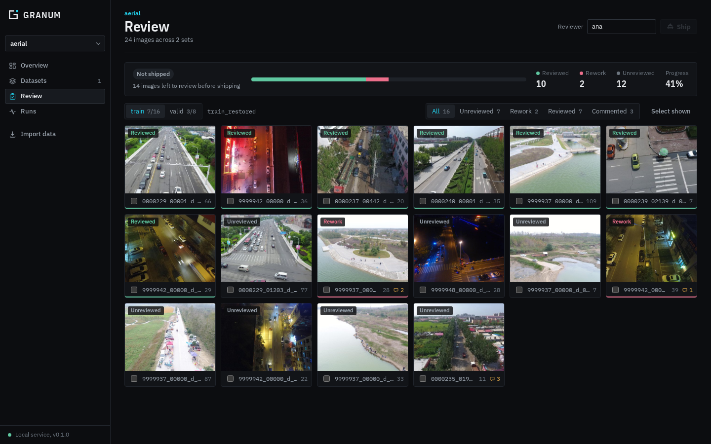
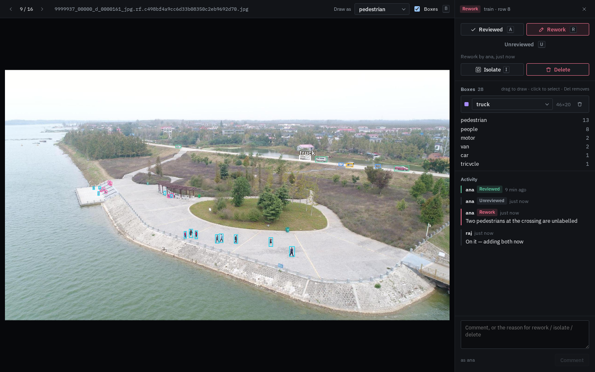

# Review and shipping

The Review tab is where a dataset is checked, corrected and approved for training. It is built
for an annotation team working with reviewers: each image has a status, a comment thread and
editable boxes, and a dataset can only be trained on after it has been shipped.



## Statuses

| Status | Meaning | Set by |
|---|---|---|
| **Unreviewed** | Not checked yet. Every new image starts here | Import, or *Reset* |
| **Reviewed** | Labels are correct | Reviewer (`A`) |
| **Rework** | Something needs fixing. A comment saying what is required | Reviewer (`R`) |

A typical loop:

1. The reviewer marks images *Reviewed* or sends them to *Rework* with a comment such as
   "two pedestrians at the crossing are unlabelled".
2. The annotator filters by **Rework**, reads the comment, fixes the boxes, replies ("added both")
   and sets the image back to **Unreviewed** (`U`).
3. The reviewer checks it again and marks it *Reviewed*.

Status changes and comments are recorded with the author's name and time, and are never
overwritten, so the full history of every image stays visible in its **Activity** panel.

The *Reviewer* name in the page header is stored in your browser and attached to everything you do.

## The Review page

- **Summary**: shipping state, a progress bar and counts of reviewed, rework and unreviewed images.
- **Set tabs**: `train`, `valid`, `test`, each with reviewed/total. An **isolated** tab appears when images are isolated.
- **Filters**: All, Unreviewed, Rework, Reviewed, Commented.
- **Grid**: each card shows the status, labelled object count and number of comments. Click to open; tick to select.
- **Selection bar**: *Mark reviewed*, *Rework…* (asks for a reason), *Reset*, *Isolate…*, *Delete…*,
  and on the isolated tab *Return to set*.
- **Shipments**: every past shipment with its author, note and versions.

## The image viewer



The left side shows the image with its labelled boxes; the right side has the status buttons,
isolate and delete, per-class box counts, the activity thread and a comment box.

### Editing boxes

| Action | How |
|---|---|
| Draw a box | Drag on the image. It gets the class chosen in **Draw as** |
| Select a box | Click it. Its class appears on the image and in the side panel |
| Change a box's class | Select it, then pick a class in the side panel |
| Delete a box | Select it and press `Delete` or `Backspace`, or click the bin icon |
| Save | Automatic when you move to another image, change its status, or close the viewer; or `Ctrl+S` |

Each save writes one new version of the set and adds an entry such as *Edited boxes: 1 added,
1 removed* to the image's activity. The browser warns before closing with unsaved edits.

Moving and resizing boxes, copy and paste, and NMS are available in the
[inspection workspace](dashboard.md#object-detection).

### Keyboard shortcuts

| Key | Action |
|---|---|
| `←` `→` | Previous / next image (saves edits first) |
| `A` | Mark reviewed and go to the next image |
| `R` | Rework (write the reason in the comment box first) |
| `U` | Back to unreviewed |
| `I` | Isolate the image |
| `B` | Show or hide boxes |
| `Delete` / `Backspace` | Delete the selected box |
| `Ctrl+S` | Save box edits |
| `Ctrl+Enter` | Post the comment |
| `Esc` | Deselect the box, then close |

## Isolate

Isolating takes images out of their set into the dataset's **isolated** set. Use it when a few
images are blocking a shipment, for example while waiting for a decision from a client.

- Isolated images do not count towards shipping, so the rest of the dataset can ship.
- They keep their status and comments, and can still be reviewed and their boxes edited.
- **Return to set** puts them back into the newest version of the set each came from. The set then
  needs reviewing and shipping again.

## Delete

Deleting moves images into the dataset's **removed** set, after a confirmation. They leave the
review and future versions, but nothing is lost: earlier versions still contain them, and they can be
put back from **Datasets → removed → Review removed**.

## Shipping

The **Ship** button is enabled only when every image in every set (isolated images excluded) is
*Reviewed*. Hovering over it explains why it is disabled.

Shipping records, per set, the exact version shipped, its image count, who shipped it, when, and
an optional note. From then on:

- **Training accepts shipped versions only.** The Train dialog lists them, and the service rejects
  any other version with `409`.
- Any later change (box edits, isolate, delete, return) creates a new version, and the summary shows
  **Changed since shipped** until the dataset is reviewed and shipped again. The earlier shipped
  versions remain trainable.

## Where it is stored

Per dataset, under the project folder:

```
<project>/reviews/<dataset>.qa.jsonl       statuses and comments, append-only
<project>/reviews/<dataset>.ships.jsonl    shipments, append-only
```

Images are identified by their image reference, not row number, so statuses survive new versions.

```python
from granum.core.qa import QaLog

log = QaLog("aerial", "human_aerial")
log.current()          # {image: {status, comments, author, time, note}}
log.thread(image)      # every status change and comment on one image
log.shipments()        # newest first, each with the versions it shipped
```

## Known limits

- No authentication: reviewer names are self-reported, and anyone who can reach the service can ship.
- No assignment of images to specific annotators yet.
- Very large sets load every image reference into the browser; the grid pages 120 images at a time.
