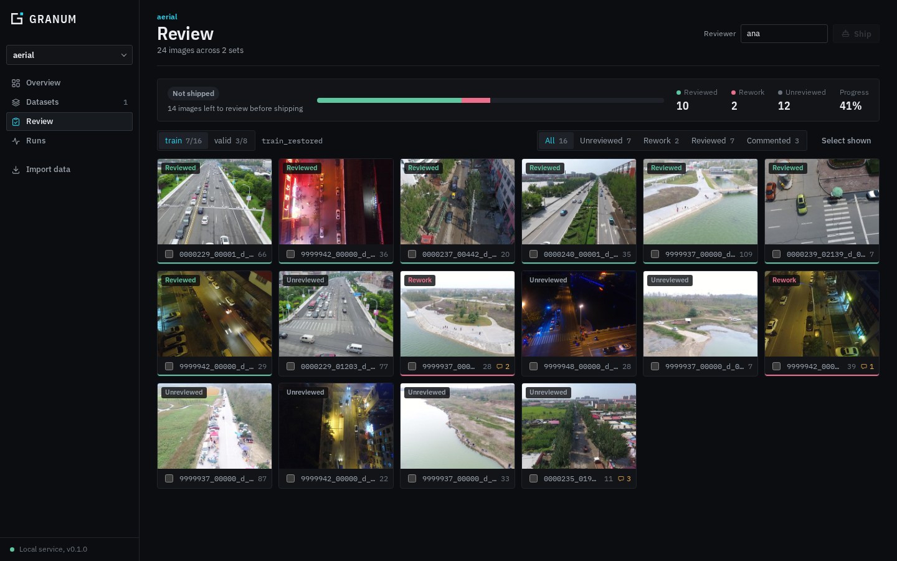

# Review, dataset versions and approval

Review checks and corrects images; **approval is a separate release gate**. A named exploratory version
can contain unverified data and can be trained deliberately. An approved release requires review evidence
matching every included image's labels, schema and media bytes. See [Operational hardening](hardening.md)
and the [recorded review course](https://granum.app/docs/course/review). This filename is retained for
existing links; the current primary UI uses **Create dataset** and **Approve…**, not a universal Ship button.



## Statuses

| Status | Meaning | Set by |
|---|---|---|
| **Unverified** | No current verification decision for these contents | Import, annotation changes, or *Unverify* |
| **Verified** | A person recorded that the inspected contents meet the review policy | Reviewer (`A`) |
| **Rework** | Something needs fixing. A comment saying what is required | Reviewer (`R`) |

A typical loop:

1. The reviewer marks inspected images *Verified* or sends them to *Rework* with a comment such as
   "two pedestrians at the crossing are unlabelled".
2. The annotator filters by **Rework**, reads the comment, fixes the boxes, replies ("added both")
  and saves. Annotation commits reset affected review state server-side.
3. The reviewer checks the new contents and marks them *Verified* if justified.

Status changes and comments are recorded with the author's name and time, and are never
overwritten, so the full history of every image stays visible in its **Activity** panel.

In local mode, the *Reviewer* name is self-reported. Shared HTTPS mode overrides it with the authenticated
account and applies workspace-wide write roles; every account can read all projects.

## The Review page

Enable **Review** in the Images ribbon. Split, class, status and field filters determine the visible
selection. The review bar reports verified, rework and unverified counts. Open images individually to
inspect full-image coverage, class policy and geometry; post a concrete reason before Rework.

**Select shown** and **Select all** have different loaded-page/filter scopes. Bulk actions do not prove
that a person inspected every selected image. Do not verify unseen images to dismiss an approval warning.
Use **Datasets** to inspect frozen versions and their explicit approval state.

## The image viewer


The left side shows the image with its labelled boxes; the right side has the status buttons,
isolate and delete, per-class box counts, the activity thread and a comment box.

### Editing boxes

| Action | How |
|---|---|
| Draw a box | Drag on the image. It gets the class chosen in **Draw as** |
| Select a box | Click it. Its class appears on the image and in the side panel |
| Change a box's class | Select it, then pick a class in the side panel |
| Delete a box | Select it and press `Delete` or `Backspace`, or click the bin icon |
| Save | Automatic when you move to another image, change its status, or close the viewer; or `Ctrl+S` |

Each save writes one new version of the set and adds an entry such as *Edited boxes: 1 added,
1 removed* to the image's activity. Both primary editors maintain IndexedDB recovery copies as well as
close warnings. Reopening offers recover/discard/export; stale revisions cannot replay automatically.
These copies belong to the same browser profile, not a server backup. Failed saves retain the draft.

Moving and resizing boxes, copy and paste, and NMS are available in the
[inspection workspace](dashboard.md#object-detection).

### Keyboard shortcuts

| Key | Action |
|---|---|
| `←` `→` | Previous / next image (saves edits first) |
| `A` | Mark reviewed and go to the next image |
| `R` | Rework (write the reason in the comment box first) |
| `U` | Back to unreviewed |
| `I` | Isolate the image |
| `B` | Show or hide boxes |
| `Delete` / `Backspace` | Delete the selected box |
| `Ctrl+S` | Save box edits |
| `Ctrl+Enter` | Post the comment |
| `Esc` | Deselect the box, then close |

## Isolate

Isolating takes images out of their set into the dataset's **isolated** set. Use it when a few
images are blocking a shipment, for example while waiting for a decision from a client.

- Isolated images do not count towards shipping, so the rest of the dataset can ship.
- They keep their status and comments, and can still be reviewed and their boxes edited.
- **Return to set** puts them back into the newest version of the set each came from. The set then
  needs reviewing and shipping again.

## Delete

Deleting moves images into the dataset's **removed** set, after a confirmation. They leave the
review and future versions, but nothing is lost: earlier versions still contain them, and they can be
put back from **Datasets → removed → Review removed**.

## Shipping

Historical shipment APIs/logs remain for compatibility. They are not automatic current approval.
The primary workflow is:

1. In Images, choose **Create dataset** and explicitly select the entire dataset or verified-only
  contents. Inspect included split counts. Both choices create an **exploratory** version.
2. In **Datasets**, choose **Approve… → Check and approve** only when the intended contents have been
  reviewed. The gate validates rows, schema and media hashes against current review evidence.
3. On an approved release, **Train** requests approved-only training and exact release membership is
  rechecked in the service and subprocess. Do not mix input revisions from unrelated releases.
4. Deliberate exploratory training is permitted with acknowledgement; direct SDK callers are trusted
  and can also explore. `latest()` does not mean “latest approved.”
5. Export the intended version in the recipient's format. Copied images are portable; links depend
  on source paths. Export is not a backup of the project history.

Approval is a human review record, not an objective label-quality certificate or proof that the dataset
is large enough. Protect external media bytes; a frozen version does not prevent an external writer
from replacing them. The [recorded handoff](https://granum.app/docs/course/handoff) approves only two
inspected images and deliberately leaves the full 120-image baseline exploratory.

## Where it is stored

Per dataset, under the project folder:

```
<project>/reviews/<dataset>.qa.jsonl       statuses and comments, append-only
<project>/reviews/<dataset>.ships.jsonl    shipments, append-only
```

Images are identified by their image reference, not row number, so statuses survive new versions.

```python
from granum.core.qa import QaLog

log = QaLog("aerial", "human_aerial")
log.current()          # {image: {status, comments, author, time, note}}
log.thread(image)      # every status change and comment on one image
log.shipments()        # newest first, each with the versions it shipped
```

## Known limits

- Local names are self-reported. Shared access uses authenticated HTTPS and roles but has no per-project tenancy.
- No assignment of images to specific annotators yet.
- Image metadata is held in the browser within explicit budgets; the grid pages 120 images at a time.
  See [measured scale](scaling.md), rather than assuming the rendering page size bounds the whole dataset.
